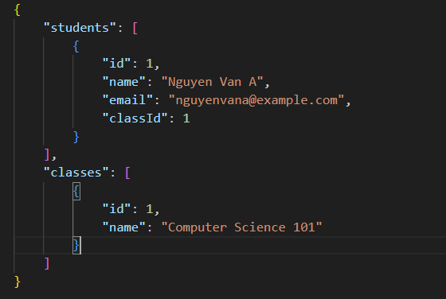

# class-management

-   Build up a basic class management APIs system to manage classes and students
-   Project structure

```
└── 📁class-management
    └── 📁public
    └── 📁routes
        └── 📁course
        └── 📁student
    └── 📁src
        └── 📁course
            └── course.controllers.js
            └── course.services.js
        └── 📁data
            └── data.json
            └── test.json
        └── 📁student
            └── student.controllers.js
            └── student.services.js
        └── 📁utils
            └── utils.js
    └── 📁views
```

-   `routes`: include router of courses and students api
-   `src/course`: include `controllers`, `services` function of course
-   `src/student`: include `controllers`, `services` function of student
-   `src/utils`: include helper function which use many times in code
-   `src/data`: due to this project doesn't database to run so I have used `json` file to keep data
-   Data design



## How to run code

-   Install libraries

```sh
npm i
```

-   Run project

```sh
npm start
```

## APIs

| API Chính            | Task                                                      | API                             |
| -------------------- | --------------------------------------------------------- | ------------------------------- |
| **Quản lí học sinh** | Thêm Học Sinh                                             | `/student/api/create`           |
|                      | Update thông tin học sinh                                 | `/student/api/update/:id`       |
|                      | Xóa học sinh                                              | `/student/api/delete/`          |
|                      | Truy xuất tất cả danh sách học sinh                       | `/student/api/get_students`     |
|                      | Truy xuất thông tin HS theo ID                            | `/student/api/get_student/:id`  |
|                      | Truy xuất thông tin HS theo Name (search LIKE)            | `/student/api/get_by_name`      |
|                      | Truy xuất tất cả học sinh theo Class (sử dụng Class Name) | `/student/api/get_by_classname` |
| **Quản lí Lớp**      | Thêm 1 Lớp                                                | `/course/api/create`            |
|                      | Update thông tin Lớp                                      | `/course/api/update/2`          |
|                      | Xóa Lớp (nếu lớp còn HS thì không được phép xóa)          | `/course/api/delete`            |
|                      | Truy xuất thông tin Lớp theo ID                           | `/course/api/get_course/:id `   |
|                      |                                                           |                                 |
